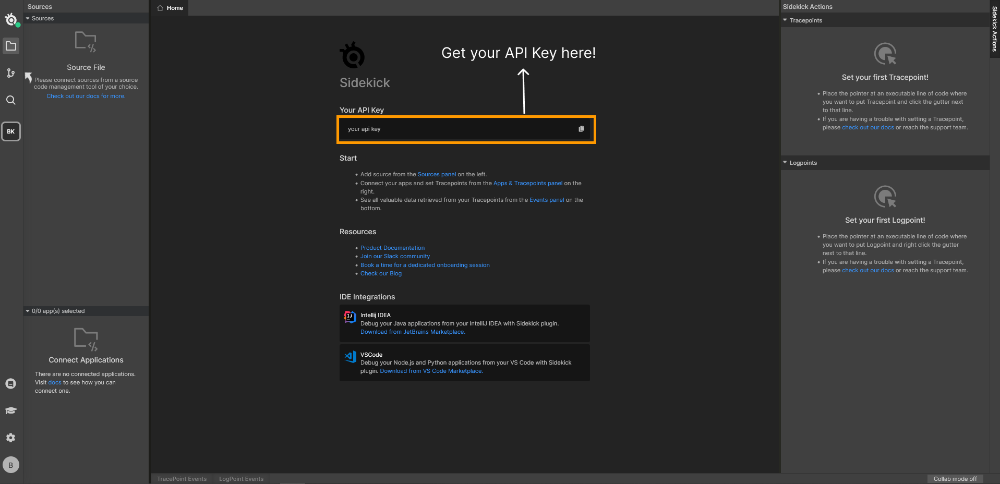
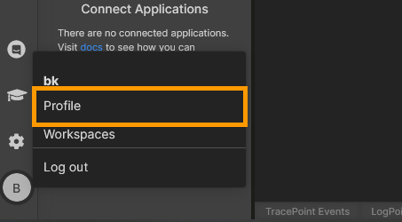
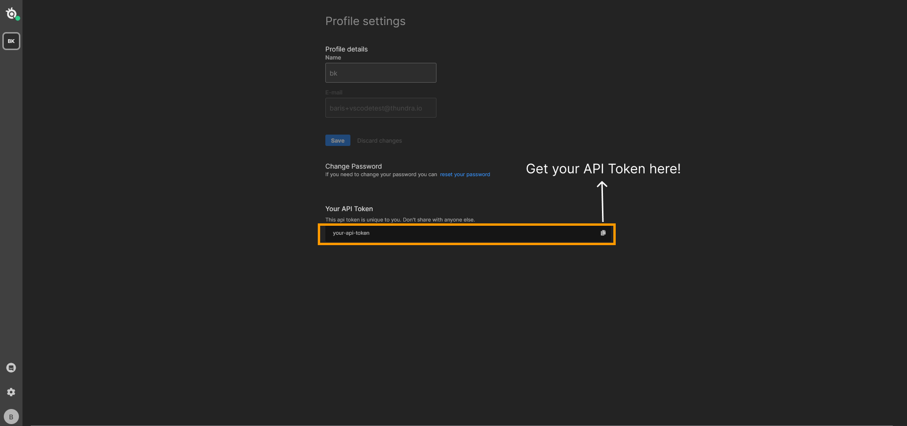

# 🗝 Get API Key & Token

:::tip
You don't need to get an API Key & token for your self-hosted instances. You will be setting your token and key as environment variables. [https://github.com/runsidekick/sidekick/tree/master#configure-environment-variables](https://github.com/runsidekick/sidekick/tree/master#configure-environment-variables)
:::

### For Sidekick SaaS:

First register and sign in at: [https://app.runsidekick.com](https://app.runsidekick.com)

#### A - Get your API Key

An API Key is needed for connecting your agents to the Sidekick broker. It is unique for each workspace.

#### B - Get Your API Token

API Tokens are used for external clients like [node.js client](../integrations/node.js-client) & [REST API](../integrations/rest-api) . It is unique for each user.

1 - Head to Profile

2 - Get your Token

