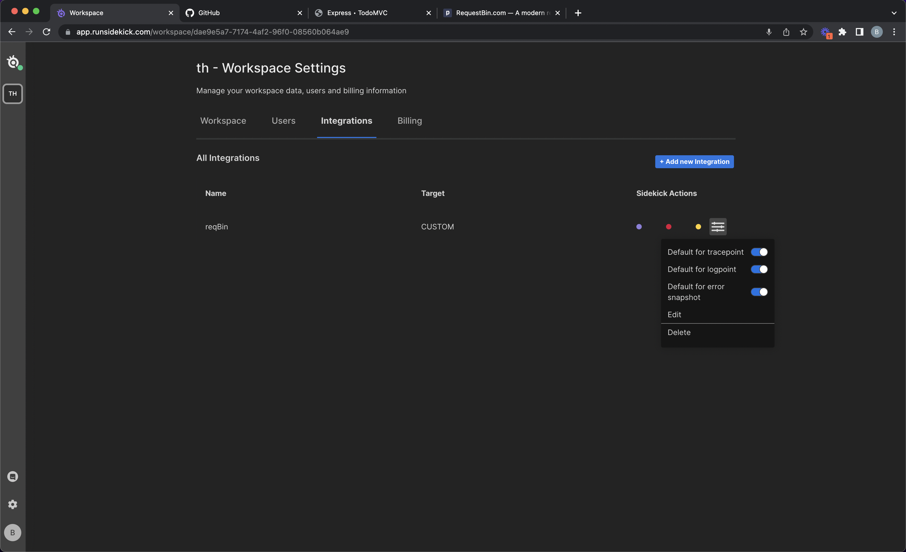

import { Card } from "@site/src/components/Card";

# Integrations

### Data target integrations

Sidekick offers

* [Slack](slack-integration.md)
* [Logz.io](logz.io-integration.md)
* [Sumo Logic](sumo-logic-integration.md)
* [Solarwinds Loggly](solarwinds-loggly-integration.md)
* [New Relic](new-relic-integration.md)
* [Elasticsearch](elasticsearch-integration.md)
* [Loki](loki-integration.md)
* [Coralogix](coralogix-integration.md)
* [Custom webhook](webhook-integration.md)

integrations within Web IDE. Those integrations allow you to send your tracepoint events, logs & error snapshots to your desired data targets.

<iframe width="560" height="315" src="https://www.youtube.com/embed/HW9Shpbfi6M" title="YouTube video player" frameborder="0" allow="accelerometer; autoplay; clipboard-write; encrypted-media; gyroscope; picture-in-picture; web-share" allowfullscreen></iframe>

  

:::info
If you can't find your desired tools on the list you can [contact to us](https://www.runsidekick.com/contact-us) or develop custom integrations via Sidekick [node.js-client](../node.js-client "mention").
:::

### Set default targets for Sidekick Actions

<figure><figcaption></figcaption></figure>

### Developing custom integrations

Sidekick [node.js client](../node.js-client "mention") offers you a way to implement custom logic using Sidekick Actions and work with Sidekick-generated data.

Furthermore, Sidekick [REST API](../rest-api "mention") is available for remotely controlling Sidekick Actions & agents, allowing you to integrate Sidekick controls within your dashboards & applications. An example usage example of Sidekick REST API is Sidekick's Grafana plugin.

Check it out here:

[Grafana plugin for remote controlling Sidekick Actions](../grafana-plugin-for-remote-controlling-sidekick-actions "mention")

### Sidekick for E2E Tests

Sidekick Test Module is an open-source web app that makes Sidekick-generated data available for E2E test cases. [Cypress plugin for E2E tests](../cypress-plugin-for-e2e-tests "mention") makes use of this module for bringing stack-based tests & error stack collection to Cypress E2E tests.

You can get Sidekick Test Module here:

<Card title="GitHub - @runsidekick/sidekick-test-module" target="https://github.com/runsidekick/sidekick-test-module" isNewWindow={true}>
  
 Sidekick Test Module 

</Card>

### Tracing Integrations

Sidekick plays well with Open-Telemetry & Thundra APM agents. Once one of those agents are installed together with the Sidekick agent, tracepoint snapshot events will be correlated to active traces when the tracepoint snapshot has been taken. So you will be able to go to the tracepoint snapshot event's related traces to understand what happened in the system during the execution of the overall flow/transaction.

