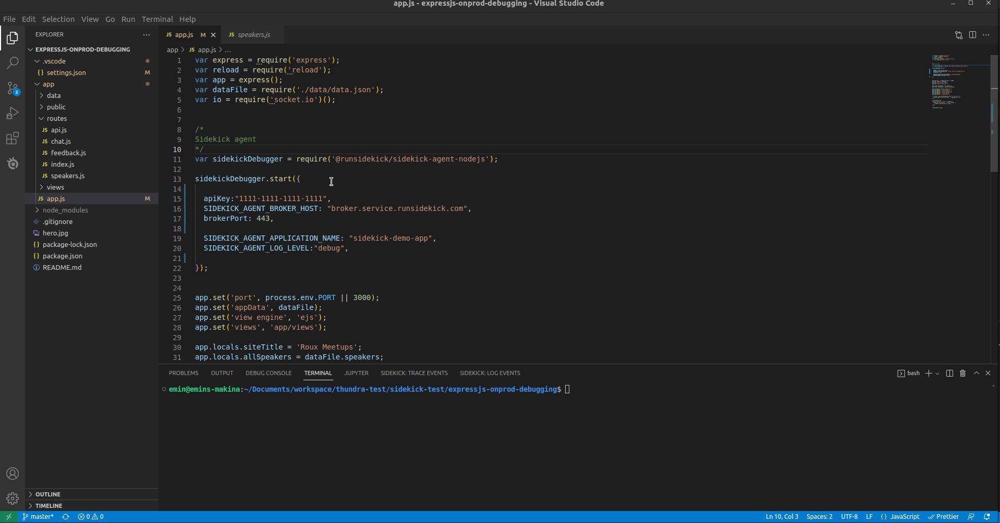
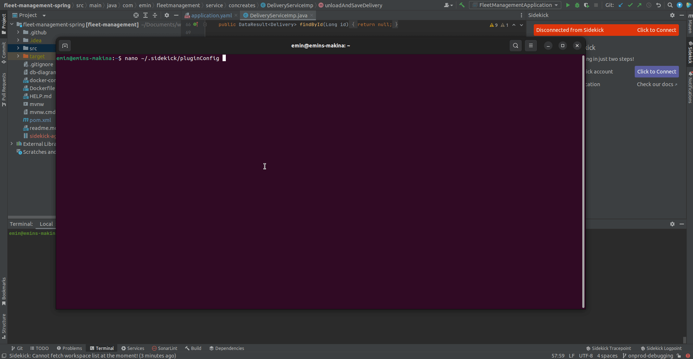

# Client Settings

#### Visual Studio Code:

<figure><figcaption></figcaption></figure>


[self-hosted-settings.md](../plugins/visual-studio-code-extension-python-and-node.js/self-hosted-settings.md)


#### IntelliJ Idea, PyCharm & WebStorm:

<figure><figcaption></figcaption></figure>


[self-hosted-settings.md](../plugins/intellij-idea-plugin/self-hosted-settings.md)


#### Node.js Client:

Set your broker and token info. Be sure to delete email & password fields.

```
 "sidekick_host": "ws://127.0.0.1",
 "sidekick_port": "7777",
 "sidekick_token": "my-token"
```

