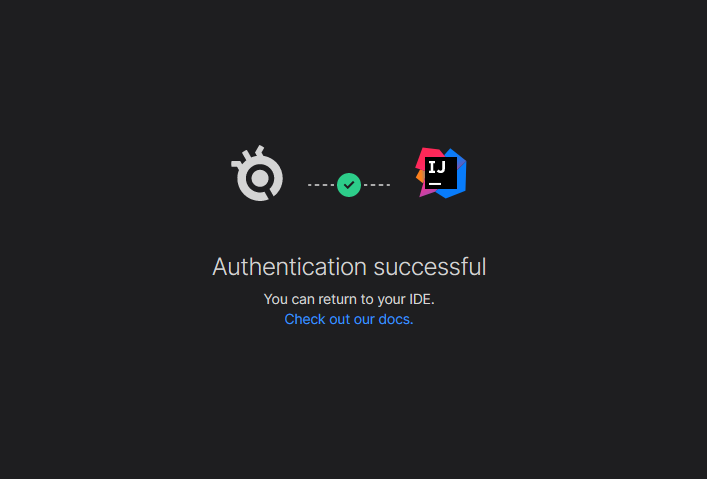
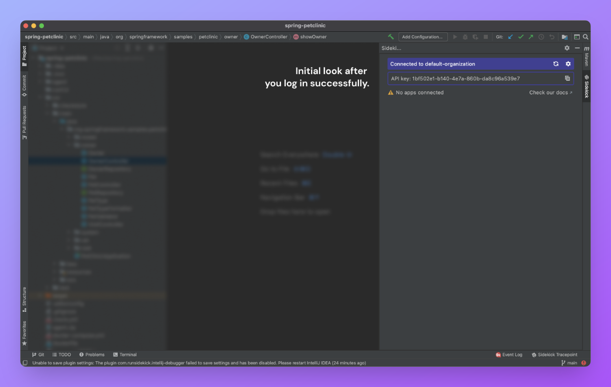
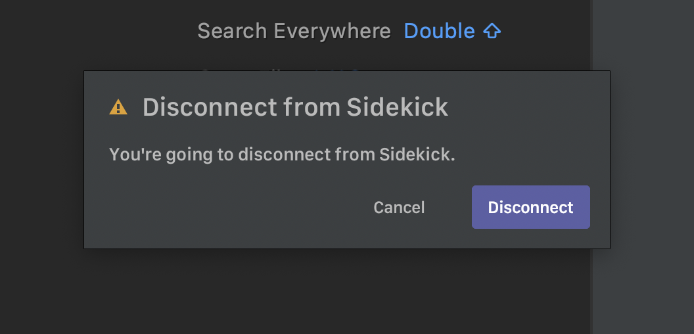

# Login and Connecting Broker

This guide explains how to log in to your Sidekick account on IntelliJ IDEA.

There are two different ways to log in:

1. By clicking the red bar (Learn more about the bar color meanings) in the main Sidekick tool window. This bar shows your connection status.
2. By clicking on the “Click to Connect” button.

Either way, clicking the button will open up your default browser to sign in.

If you don’t have a Sidekick account yet, you can click the “Sign up” button to create your account.

:::info
If you want to deploy your own broker and use Sidekick as on-premise to your address, please reach us by sending an email to [support@runsidekick.com](mailto:support@runsidekick.com).

You can also check out our open source repo : [https://github.com/runsidekick/sidekick/](https://github.com/runsidekick/sidekick/)
:::

If the login succeeds, the application instances and associated tracepoints (if any) will be listed in the main Sidekick tool window:

To disconnect, you need to click the "Disconnect" after you click on the Gear icon at the top-right, and then confirm the operation:

:::info
Note that the initial release only supports the ability to connect from one project source at a time. So, if you open the source code of multiple projects simultaneously, you can only connect from a single project and will be disconnected automatically from other ones.
:::

