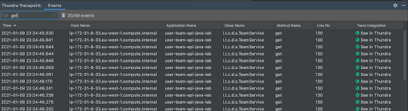

# Browsing Tracepoint Events



When the code execution hits the tracepoint,  Sidekick automatically captures a tracepoint event, which will then appear in the table of Sidekick Tracepoint Events at the bottom.&#x20;

Until the first event is received, the events table will be shown as empty.

When more snapshot events are captured, they will be listed in the table shown below:

You can search a substring of the following columns to narrow down the list: _Host Name, Application Name, Class Name, Method Name, Line No._

If too many events are received above a certain threshold, they will not be listed in the table as a protection mechanism. This case is indicated by the red text above the table. You can click the trash icon near the search box to clear the table.


Note that the table row count limit is 1000.&#x20;

