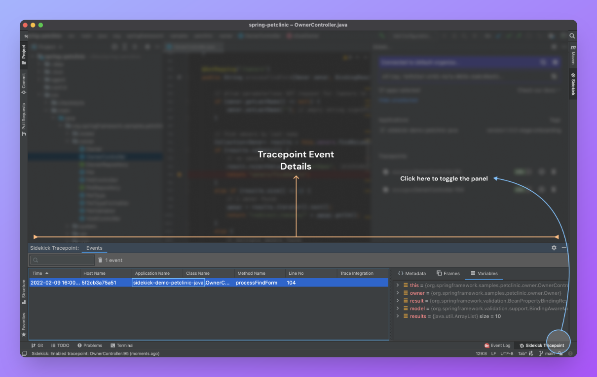

# Tracepoint Event Detail

When you double-click an event on the events table, you can see the snapshot details right next to the tracepoint list

You can find more details about the event on the metadata section, and the call stack till to the line of tracepoint on frames section,  and can see the captured local variables in the variables section.

:::info
Note that we are not supporting capturing variables for the parent frames yet. It is planned for future releases.
:::

If the class cannot be located at the moment, the navigate/locate icons become hidden both on the tracepoint list and event metadata panel. Some of the possible causes of being unable to locate a class are:

* Indexing is in progress. IDEA didn’t complete parsing source code files, so it doesn’t know the location of specific classes.
* The class file is not part of an IDEA project.
* The class file doesn’t belong to the current project.
