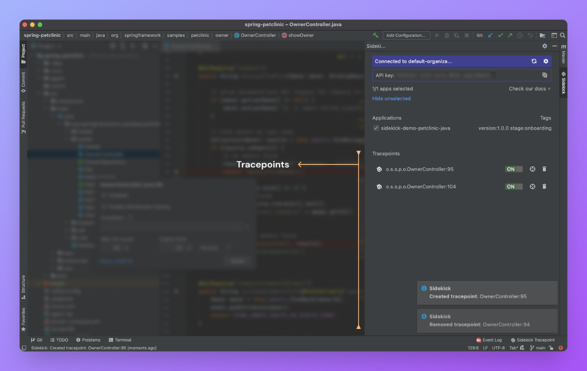

# Tracepoints

When you put a [tracepoint](../../../reference/faq.md#what-does-a-tracepoint-mean) on a line, the Sidekick agent on the corresponding remote application takes a snapshot of the local variables on that point when the execution passes from that point and sends them as tracepoint snapshot events back to the IntelliJ IDEA.

You can see the existing tracepoint associated with each application instance under the corresponding instance section on the main Sidekick panel:

