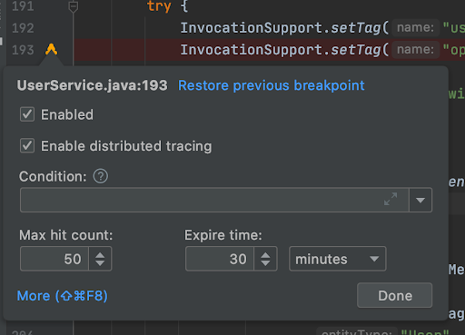
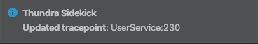
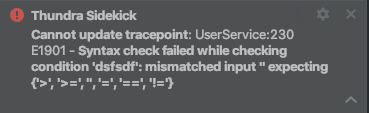

# Edit Tracepoint

It is possible to edit a tracepoint by right-clicking on the tracepoint icon, similar to any arbitrary breakpoint. From this window, it’s possible to enable or disable the tracepoint, enable or disable distributed tracing (disabled by default), to define the condition for taking snapshots, and to change the default expiration settings of the tracepoint.

When you complete your edits, you can click on “Done” at the bottom-right of the modal. The result of the tracepoint editing will be given as a notification balloon at the bottom-right of IntelliJ IDEA.

When tracepoint editing fails, an error notification will appear at the bottom-right of IntelliJ IDEA.

