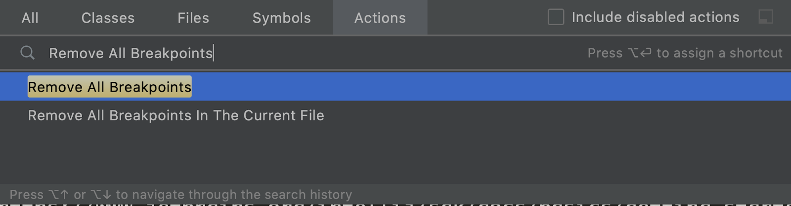
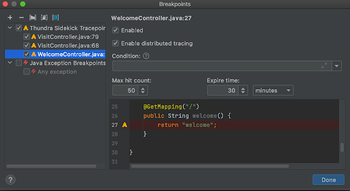
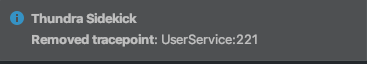

# Remove Tracepoint

There are multiple ways to remove a tracepoint.

The first method is to click the gutter icon on the editor as usual. This will remove the tracepoint from all application instances.

The second method is to click the trash icon near the tracepoint line on the main tool window. By using this method, you will be removing the tracepoint from just one instance at a time:

You can remove tracepoints also using the methods working for breakpoints such as running “Remove All Breakpoints” (or similar) action, or using the “Breakpoints” dialog:

When you removed a tracepoint, you will see the success message:

