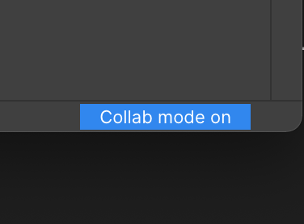

# Enable/Disable Collaborative Debugging

Simply use the button available at the bottom left of Sidekick Web App to start collecting logs & events from other collaborators. When this mode is enabled you don't need to put a tracepoint or a logpoint, you will start collecting data from other peer's logpoints & tracepoints.

<figure><figcaption></figcaption></figure>
