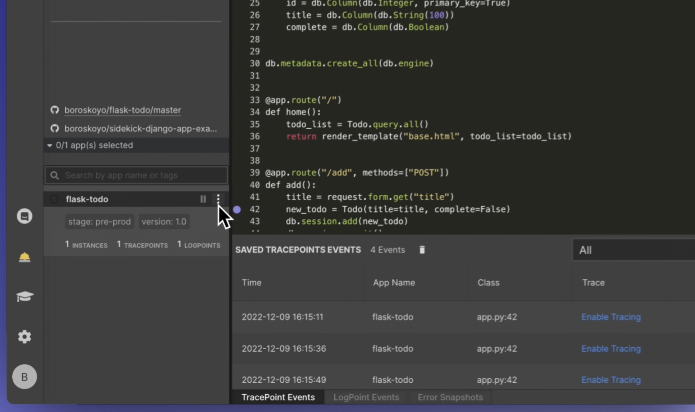
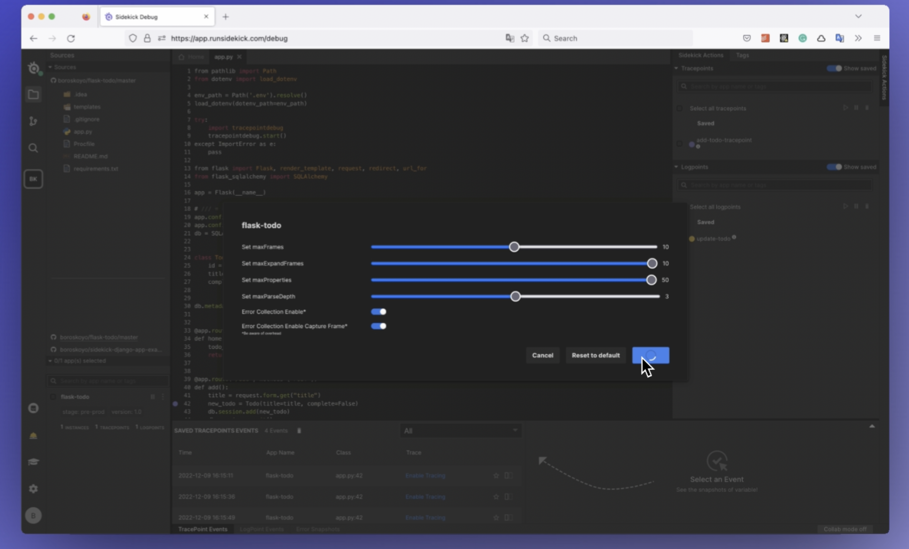

# 🎇 Remote Config

Remote Config allows us to easily attach and detach Sidekick agents from running applications as well as change agent settings remotely using the Sidekick WebIDE. This can be particularly useful for users with multiple apps with Sidekick agents installed, as it allows us to manage the agents from a central location.

With Remote Config, we can simply log in to the Sidekick WebIDE and select the apps they want to manage. From there, we can attach or detach agents and change the agent settings, such as the Error Stack Collection status and max number of frames. This saves users time and effort, as they no longer have to access each app to make these changes.

<figure><figcaption></figcaption></figure>

<figure><figcaption></figcaption></figure>

