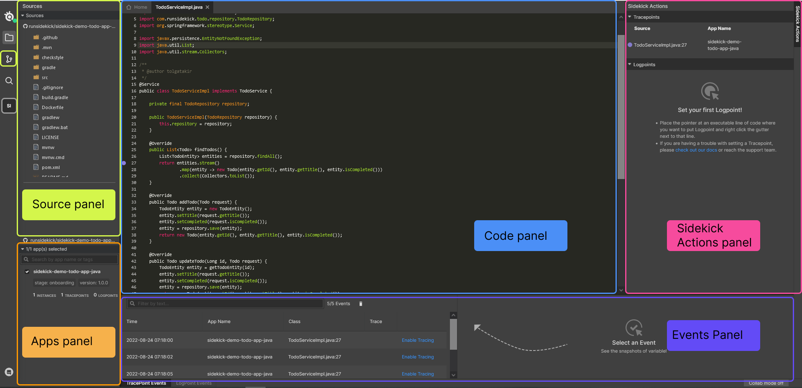

# Introduction to Web Application

This guide explains the components of Sidekick's Web Application.&#x20;

Sidekick lets developers debug their remote applications without stopping. In this "Debug" view, our users can find everything they need to debug a remote application with tracepoints. Let's dive into the different parts of the application together

<figure><figcaption></figcaption></figure>

There are four main components in Debug view:

* [Source Panel](source-panel.md)
* [Code Panel](code-panel.md)
* [Apps and Tracepoints Panel](apps-and-tracepoints-panel.md)
* [Events Table](events-panel.md)
