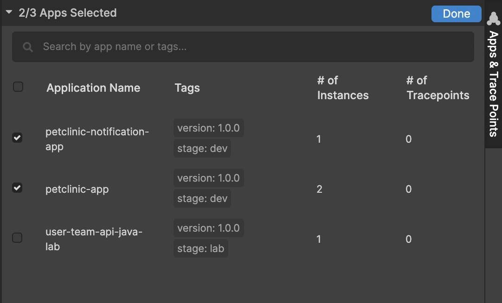
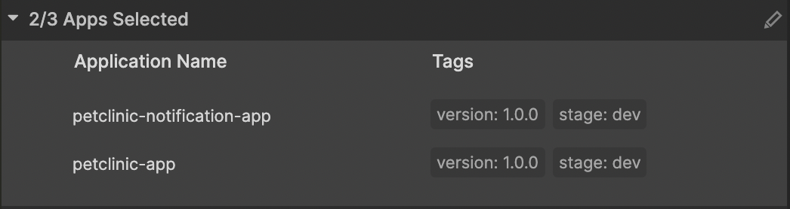
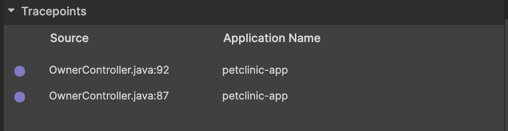
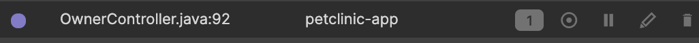

# Apps and Sidekick Actions Panels

.png)

In order to start debugging with Sidekick, one of the pre-requisites is to install Sidekick agent into your app and select it on the Sidekick dashboard. Apps and tracepoints panel let developers manage their Sidekick agent installed applications and tracepoints set on those applications.

### Apps Section

After you successfully instrument your application, you'll need to select the applications that you'll work on during your debugging session. You can open the application selection screen by clicking the pencil button at top-right.

#### Selecting Applications to Debug

After you click on the pencil button, you'll see the below screen to select the applications you want to debug. When you select an application, you'll be automatically select all instances of that application.

Here you'll see all the applications with their identifying tags. You'll also see how many instances of this application are live now and how many tracepoints are currently active on the application. Clicking on the "Done" button will take you to the previous screen this time showing the selected applications. See below:

Now, you can set up a tracepoint by clicking on the gutter area on the code editor area. You can further edit your application selection by clicking on the pencil button on top-right.

### Tracepoints Section

This section shows the list of active tracepoints by adding some inline action buttons with them.

By hovering on any of the tracepoints in this table, you'll see the action buttons for a tracepoint as below:

The action buttons in a row are useful for the following jobs respectively from left to right:

* Showing the events of a particular tracepoint on [Tracepoint Event Table](events-panel.md)
* Locating the tracepoint in the source code on the code editor area
* Enabling/disabling the tracepoint (Enable if disabled, disable if enabled)
* Editing the tracepoint
* Removing the tracepoint

#### Editing a tracepoint

We may want to make the tracepoint conditional by defining a condition to take a snapshot during code execution. We may want to change the default expiration settings of the tracepoint or we may want to remove the distributed tracing connection of a particular tracepoint using the "Edit Tracepoint" modal. When clicked save, our tracepoint will be active with the new configuration.

.png>)
