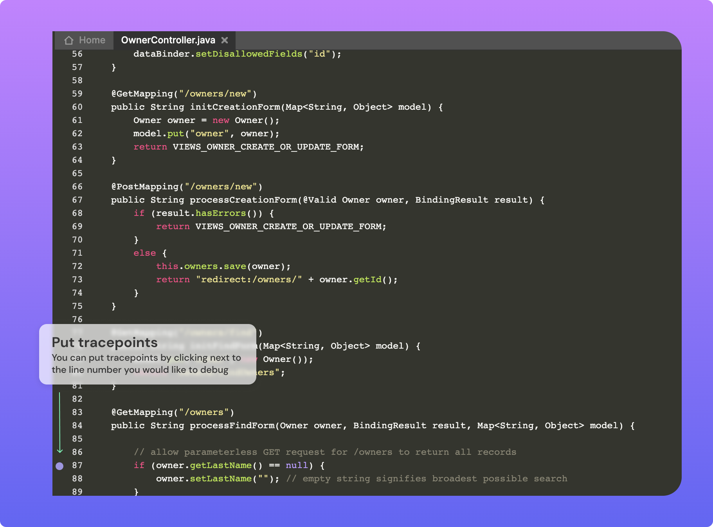
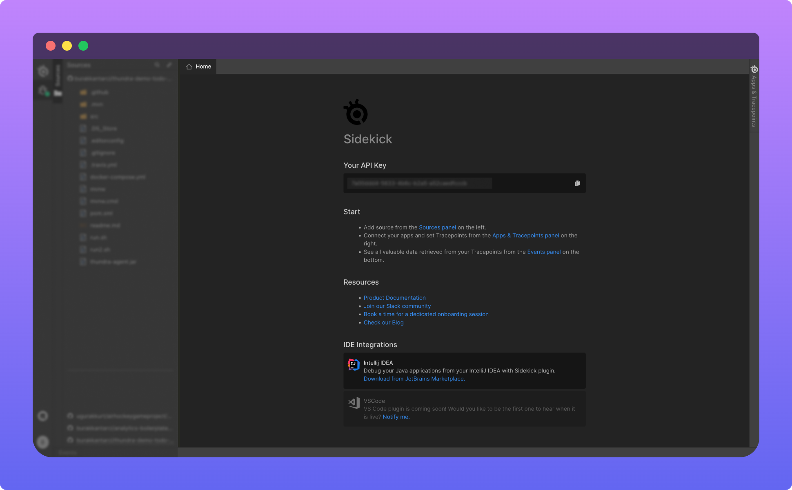

# Code Panel

After you [connect your code](../how-to/import-source-code.md), you can open any file that you'd like to view or debug to the code panel. Sidekick lets you put tracepoints for the application code.

After installing Sidekick agents to your application and selecting an application to debug, you can start putting tracepoints just by clicking the gutter area. You'll see a violet circle appearing when the tracepoint is set. You can also put tracepoints and log points by right-clicking to the desired point.

#### Welcome Tab

Welcome Tab in the code editor area always stays open in the application shows:

* API Key to install Sidekick agent to your application.
* Instructions for getting started with Sidekick
* Resources that might be helpful while using Sidekick
* Navigation to our integrations

