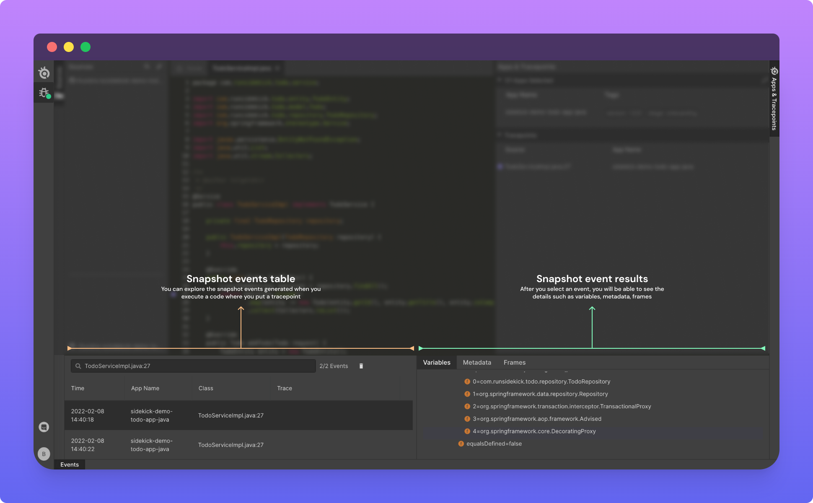
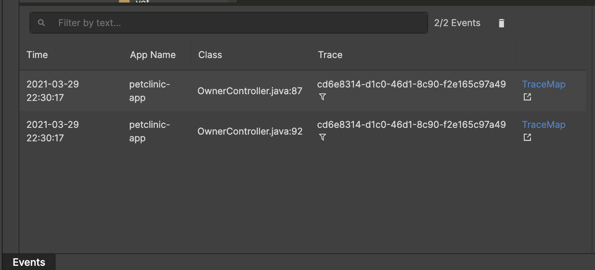
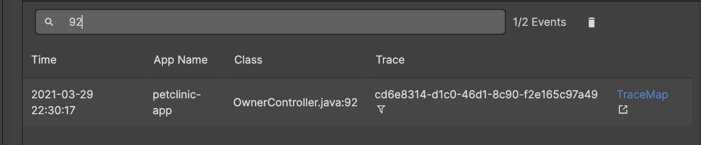
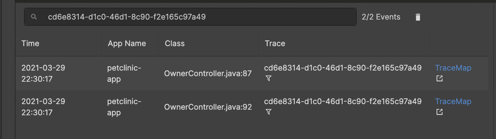
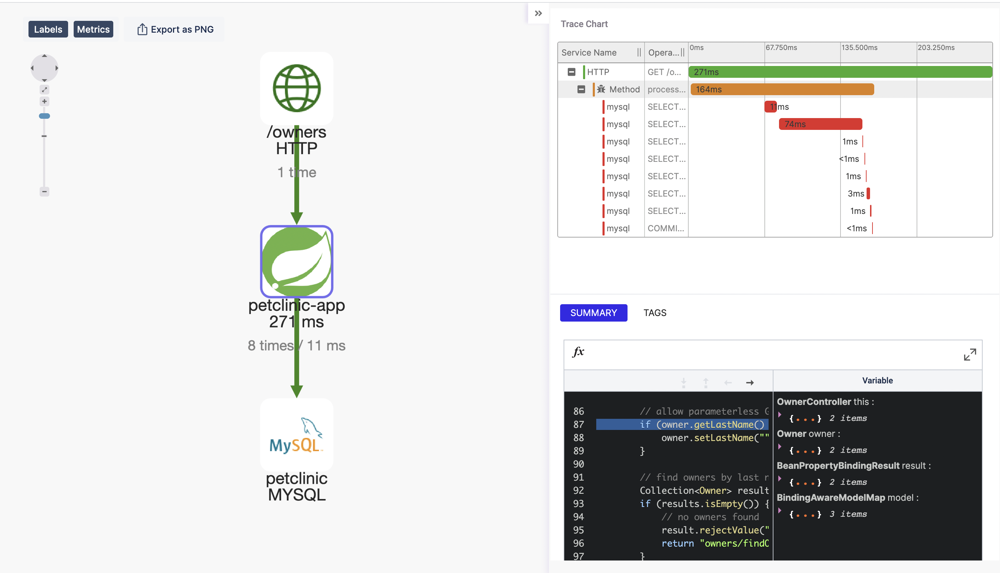
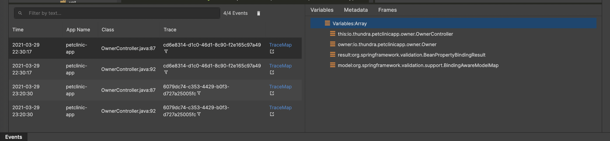
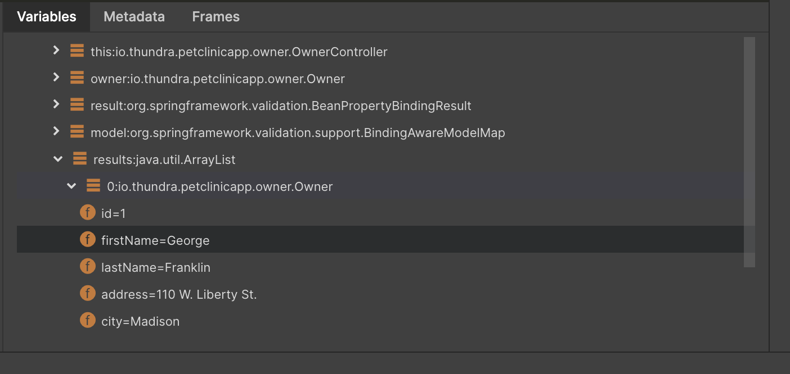
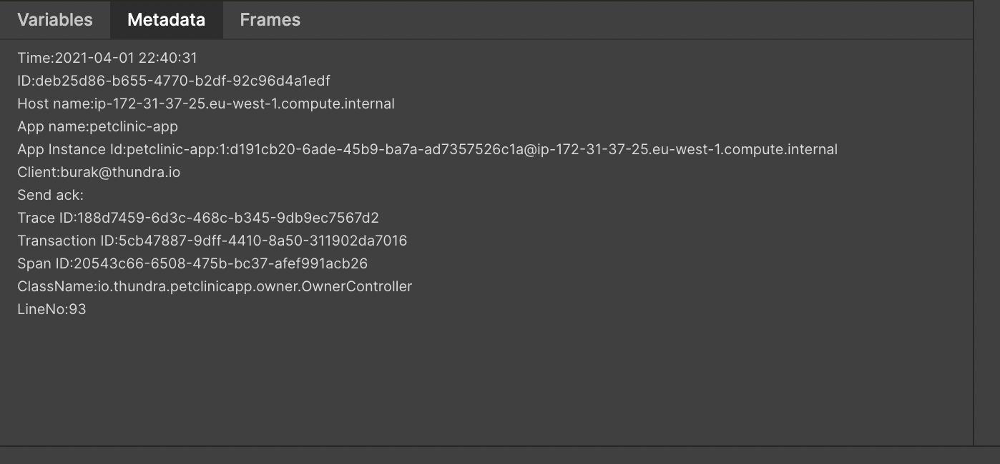
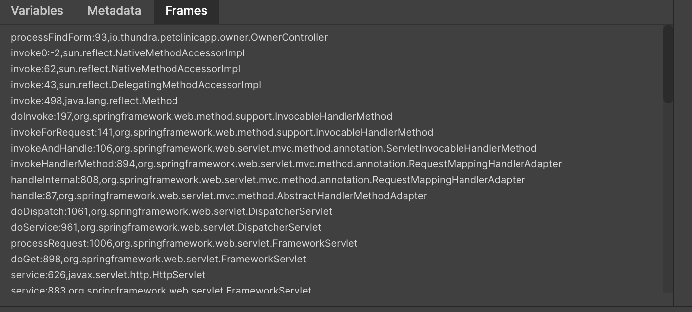

# Events Panel

After you put a tracepoint and execute the code, Sidekick will take a snapshot of the application. You will be able to see the list and the details of snapshot events taken by the Sidekick on the Events panel.&#x20;

### Snapshot events table

Writing any text to the search area will filter the Tracepoint Event Table as shown below:

Filtering by trace-id's has the special power of listing all tracepoints of the same transaction. However, it's hard to write to the text area. To filter by trace id, you can click on the "Funnel icon" next to the value in the "Trace" column.

For each tracepoint, a distributed trace is generated automatically when distributed tracing is enabled. By clicking on the "TraceMap" in the row of an event, you'll be navigated to the distributed trace of that event in Thundra APM.

When clicked on a tracepoint event table, the details of the snapshot are taken on the right in the Snapshot event results

Snapshot Event Results is designed to demonstrate detailed information about the tracepoint event (a.k.a snapshot). In this area, there are three tabs that give us information about the tracepoint event from different aspects:&#x20;

* Variables Tab
* Metadata Tab
* Frames Tab

#### **Variables** **Tab**

This tab gives the most used information about a tracepoint event. As understood from the name, you can see the values of variables, while the code execution invokes the code at the line where tracepoint is put.&#x20;

#### Metadata Tab

This tab provides extra information gathered by Sidekick agents such as the IP address of app instance, exact time of tracepoint event, and more. This information might be useful while comparing different tracepoint events.&#x20;

#### &#x20;Frames Tab

This tab provides the execution path to where Sidekick takes a snapshot back from the calls that are coming from caller functions even back to the codes of framework that you're using.&#x20;

