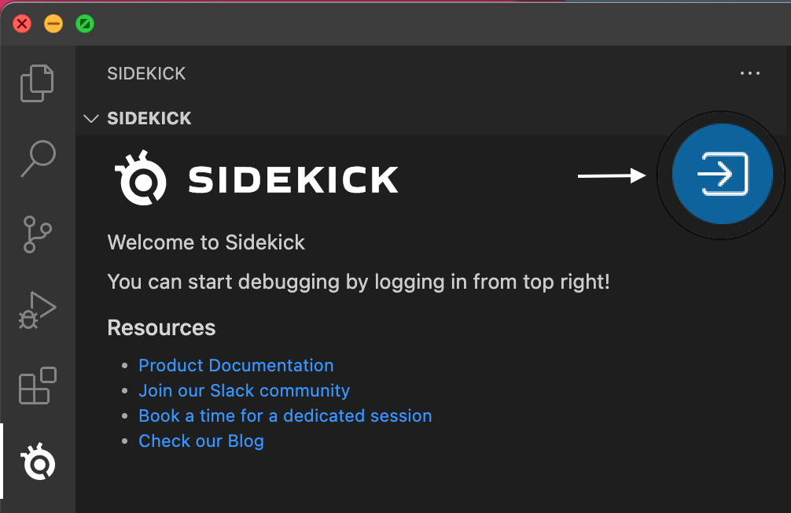
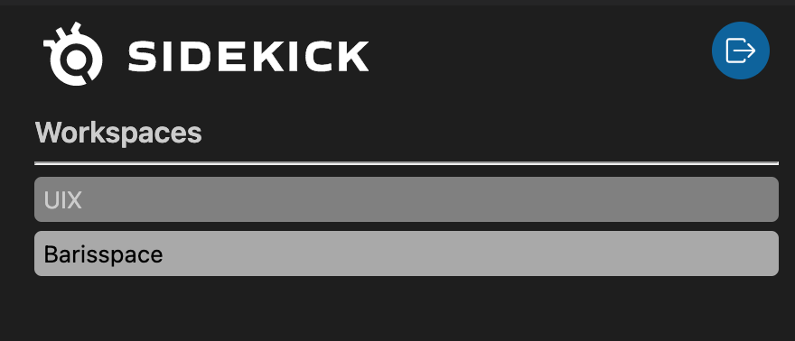

# Login & On-boarding

Clicking the login button will open up your default browser to sign in.

:::info
If you don’t have a Sidekick account yet, you can click the “Sign up” button to create your account.
:::

If the login succeeds, your workspaces will be listed in the main Sidekick window:

