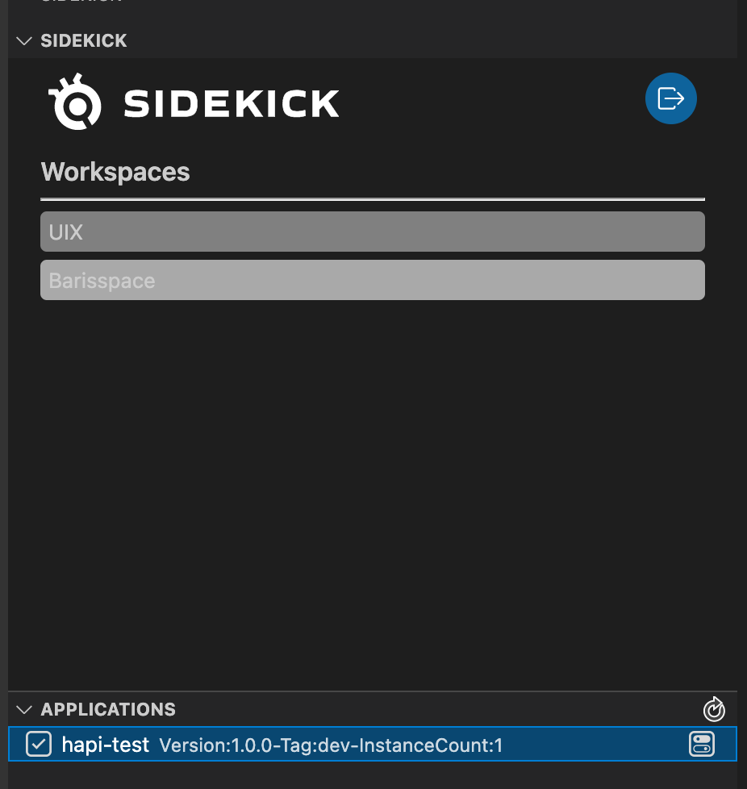

# Select Workspace & Application

Sidekick allows you to have more than one workspace so that you can seperate your apps for different contexts or environments.

Every workspace that you are a part of is listed inside the initial Sidekick panel. You can change your workspace by clicking on desired workspace's name.

When you change your active workspace, applications related to that workspace will be loaded. You can then change the active application by clicking on the application you want to debug.
