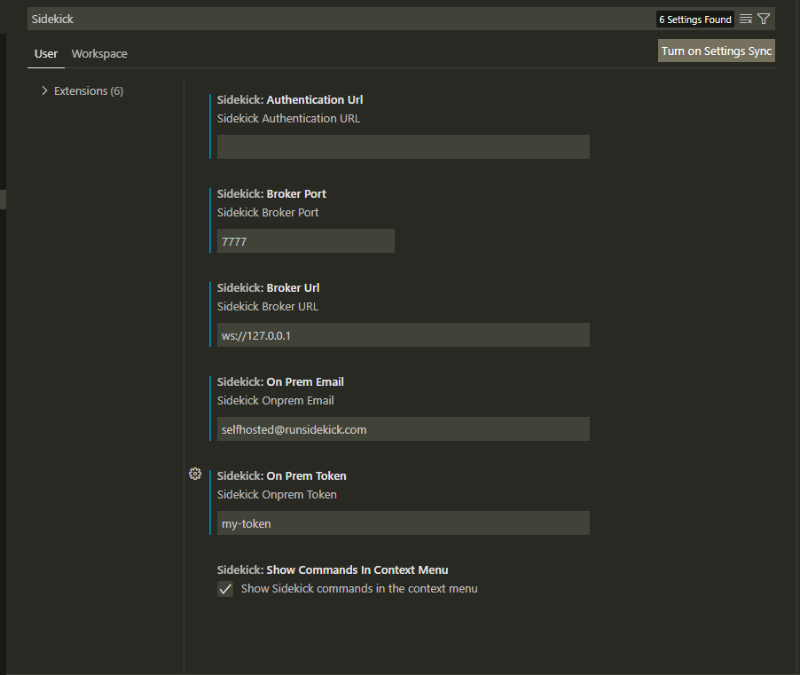

# Self-hosted Settings

You need to change your broker host and port at the Sidekick settings.

Authentication Url must be cleared and all other fields must be filled. E-mail field is necessary and you can write any email.

If you are having any troubles be sure to update both User and Workspace settings.
