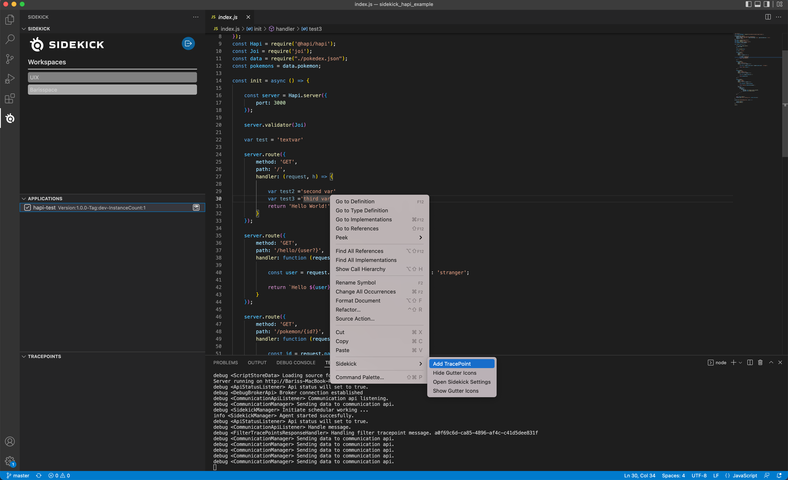
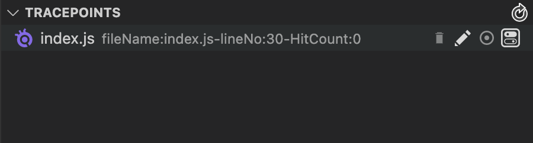

# Tracepoints & Logpoints

When you put a tracepoint on a line, the Sidekick agent on the corresponding remote application takes a snapshot of the local variables on that point when the execution passes from that point and sends them as tracepoint snapshot events back to your VSCode instance.

