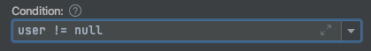
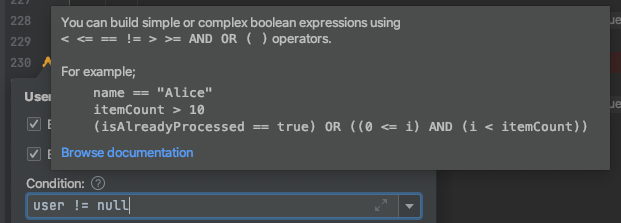

# Conditional Expressions

You may need to take snapshots only when certain conditions are met. Use the “Condition” box in the edit popup to specify an optional condition:



The condition syntax was kept very simple to make it understandable without referring to a manual. Any developer who is already using a mainstream language should feel familiar with the syntax. If you are not sure, you can look at the quick tip by hovering the question mark next to the “Condition” label:



Basically, the conditions defined should return a boolean value. So, some of the simplest forms consist of a comparison operator and two operands (variable or literal) like below:

```javascript
id != null
name == "bob"
isRegistered == true
itemCount > 0
failedCount <= recoveredCount
```

You can combine those expressions with binary boolean operators to build more complex expressions:

```javascript
id != null && isRegistered == true
id != null AND isRegistered == true

itemCount > 0 || failedCount <= recoveredCount
itemCount > 0 OR failedCount <= recoveredCount
```

You can use parentheses to force precedence between multiple boolean clauses:

```javascript
(id != null && isRegistered == true) OR (itemCount > 0 || failedCount <= recoveredCount)
```

Another feature is using placeholders to get the primitives in the objects. You can access certain properties that are normally not available as a local variable at the tracepoint location, using the special syntax: `{spring.user.name}`
