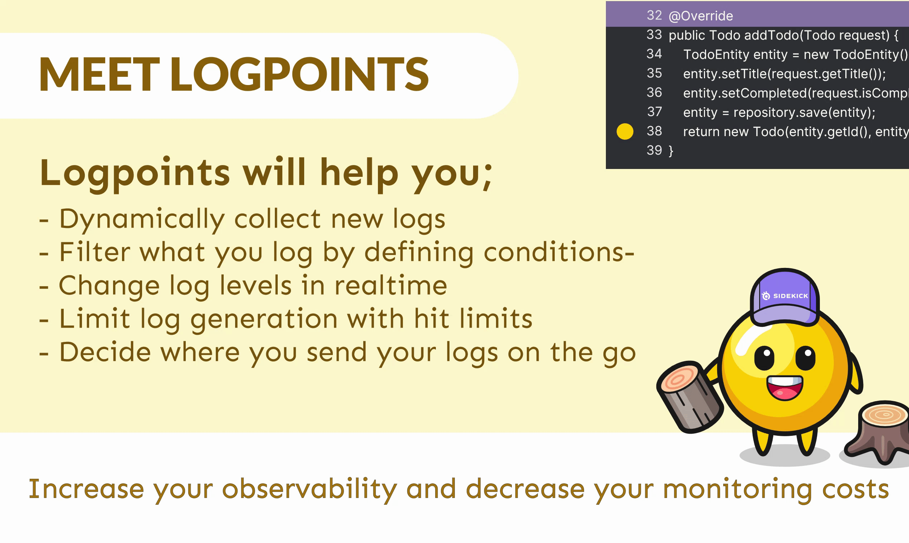

# 🪵 Logpoint

Logpoints bring the power of dynamic logging to Sidekick users. Replacing traditional logging with dynamic logging has potential to lower stage sizes, costs and time for log searching while giving ability to add new logpoints without editing the source code, redeploying or restarting the application.

<figure><figcaption></figcaption></figure>

Logpoints are points that you can add to your running application, just like Tracepoints, for adding logs dynamically.&#x20;

Since you can add and remove your logs at any time, getting the log wherever and whenever you need it becomes a walk at the park! Not only solving the issues of traditional logging, but Sidekick Logpoint feature also comes with extras. In addition to adding and removing logs on demand, with Sidekick you can:

\
\-Define conditions for your logpoints\
\
\-Define time to live and maximum hit counts

\-Change log levels dynamically

\-Enrich your log content with variable information from the context

\-Configure agent to print logs directly to **stdout**

\-Send generated logs to any target you desire!

### See in action:

{% embed url="https://www.youtube.com/watch?v=HW9Shpbfi6M&ab_channel=Sidekick%28byThundra%29" %}

## How to use logpoints:

### Put Logpoint



### See Logs



### Edit Logpoint



### Delete Logpoint


